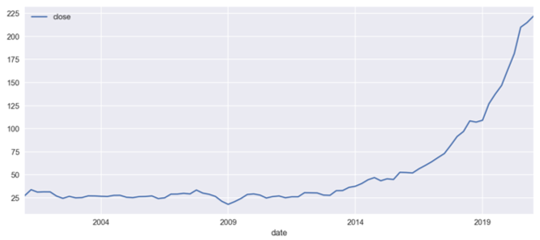

#  Project 4: Applying Unsupervised Learning Algorithms - Time Series Forecasting for Microsoft Company Stock Market
by : Modhi Almannaa - Shahad Almangor - Rehab Alharbi

### Description

This Jupyter notebook walks through the Microsoft stock datasets and explores various Time Series Analysis and models.

Microsoft Dataset was collected from twelvedata.com by web scraping, Microsoft Stock market from 2001 to the beginning of 2021. we worked on this data using time series analysis and models.
- [Microsoft Stock Market](https://www.kaggle.com/rawaneid/microsoft-stock-market-2001-2021)

Our goal is to predict the stock market of Microsoft in the future by using time series models and find the lowest error rate.

---

### Problem statement

In 2020 and 2021, we noticed a big difference in Microsoft's stock data, which may be due to Covid 19, which affected many companies, large and small.

Given open, high, low, close, and volume data, we will build a model to predict the stocks in 2024. This aims to be a more accurate method of predicting and find the lowest error rate. In turn, this will help the Microsoft company make decisions.

Our model performance will be guided by the RMSE Error and predict the lowest error rate.

  
---

### Data Import & Cleaning

The following datasets were given and It was cleaned :

Microsoft Stock market (2001 - 2021) dataset. Upload this dataset from Kaggle.

Rename column 'Unnamed: 0' into 'date' and change type as DateTime

Extract subset from dataset to play around it which is the close column that means the price of MSFT when the stock market closes or final price.

Resample our data index into quarter

---

### EDA

After cleaning and looking through our datasets, we did several EDA and visualize to explore the dataset :

Index of Dataframe:

DatetimeIndex(['2001-03-16', '2001-03-19', '2001-03-20', '2001-03-21',
               '2001-03-22', '2001-03-23', '2001-03-26', '2001-03-27',
               '2001-03-28', '2001-03-29',
               ...
               '2021-01-15', '2021-01-19', '2021-01-20', '2021-01-21',
               '2021-01-22', '2021-01-25', '2021-01-26', '2021-01-27',
               '2021-01-28', '2021-01-29'],
              dtype='datetime64[ns]', name='date', length=5000, freq=None)
              
head of subset from main dataset:

Visually examine:

---

### Best Model and Conclusions

In this project, we have attempted to the model of Microsoft stock market(2001 - 2021) Obtain low RMSE Error.Using Autoregressive Model (AR), ARIMA model, Holt Model, The best model was ExponentialSmoothing Model  RMSE Error: 9.963839976, Also we used plots to visualize as we mention. Now after we analysis and  predicted the Microsoft stock market in 2024 ,they can make a decisions

